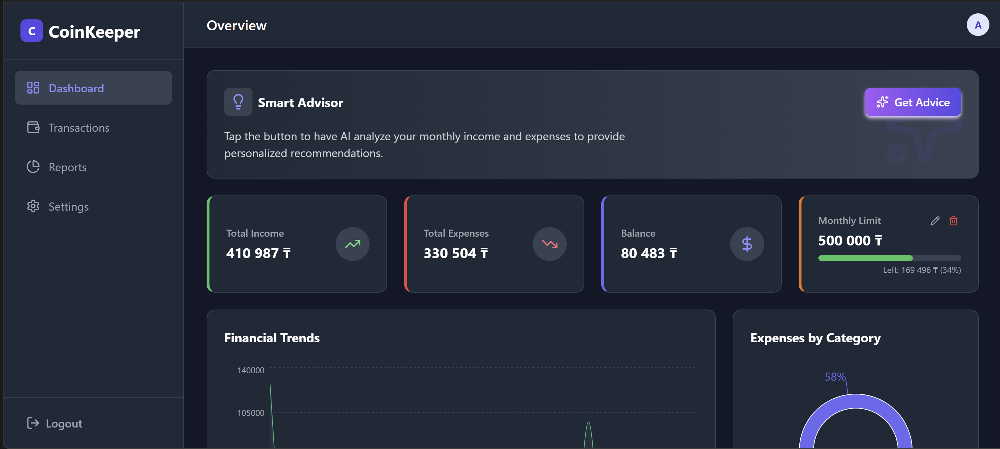
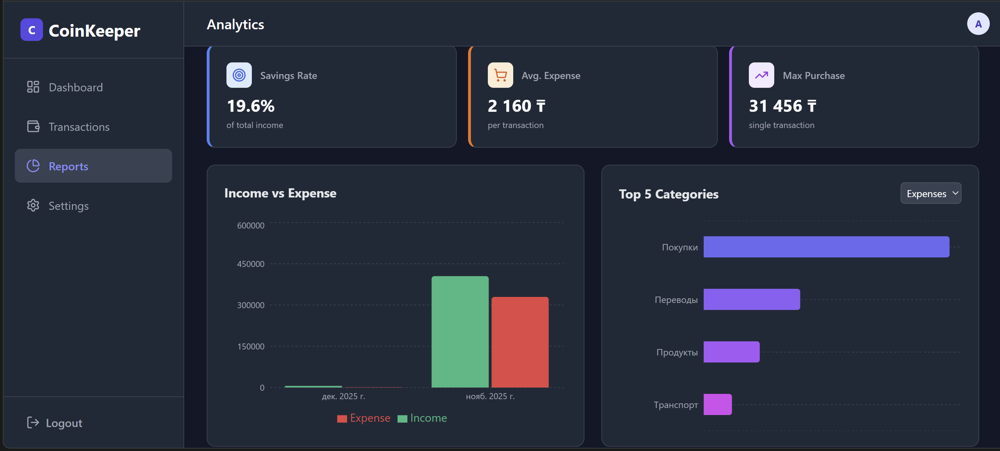
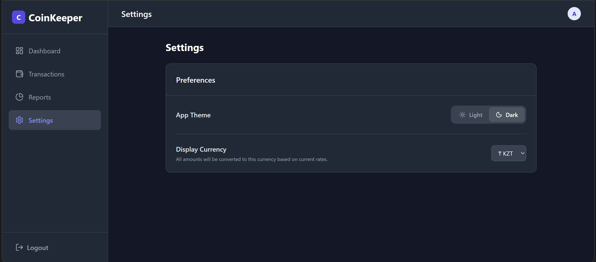

# 💰 CoinKeeper

<div align="center">


**Современное веб-приложение для управления личными финансами с AI-аналитикой и мультивалютной поддержкой**

[Демо](#) • [Документация](#) • [Сообщить об ошибке](#)

</div>

---

## 📋 Оглавление

- [О проекте](#-о-проекте)
- [Основные возможности](#-основные-возможности)
- [Технологический стек](#-технологический-стек)
- [Установка и настройка](#-установка-и-настройка)
- [Использование](#-использование)
- [Структура проекта](#-структура-проекта)
- [Переменные окружения](#-переменные-окружения)
- [Скриншоты](#-скриншоты)
- [Разработка](#-разработка)
- [Лицензия](#-лицензия)

---

## 🎯 О проекте

**CoinKeeper** — это полнофункциональное приложение для управления личными финансами, которое помогает отслеживать доходы и расходы, анализировать финансовые привычки и получать персональные рекомендации на основе AI.

Приложение разработано с использованием современных технологий и предоставляет интуитивно понятный интерфейс для эффективного управления бюджетом.

---

## ✨ Основные возможности

### 📊 Управление транзакциями
- ➕ Добавление доходов и расходов с категоризацией
- ✏️ Редактирование и удаление транзакций
- 📅 Фильтрация по датам и категориям
- 🔍 Поиск и сортировка транзакций

### 💱 Мультивалютная поддержка
- Поддержка 4 валют: **KZT**, **USD**, **EUR**, **RUB**
- Автоматическое обновление курсов валют
- Конвертация всех сумм в выбранную валюту
- Локализованное форматирование чисел

### 📈 Аналитика и отчеты
- Интерактивные графики доходов и расходов
- Круговые диаграммы по категориям
- Анализ трендов за различные периоды
- Визуализация финансовых данных с помощью Recharts

### 🤖 AI-аналитика
- Персональные финансовые рекомендации на основе Google Gemini API
- Анализ расходов и предложения по оптимизации бюджета
- Умные советы по управлению финансами

### 🎨 Пользовательский интерфейс
- 🌓 Темная и светлая темы
- 📱 Адаптивный дизайн для всех устройств
- 🎯 Интуитивная навигация
- ⚡ Быстрая работа благодаря Vite

### 🔐 Безопасность
- Аутентификация через Supabase Auth
- Безопасное хранение данных
- Защита API ключей через переменные окружения

### 📄 Импорт данных
- Загрузка PDF выписок
- Автоматическое извлечение транзакций из документов

### 🎯 Управление бюджетом
- Установка месячных лимитов расходов
- Отслеживание прогресса по лимитам
- Предупреждения о превышении бюджета

---

## 🛠 Технологический стек

### Frontend
- **React 19.2.0** — UI библиотека
- **Vite 7.2.4** — Сборщик и dev-сервер
- **Tailwind CSS 3.4.18** — Utility-first CSS фреймворк
- **Recharts 3.5.1** — Библиотека для графиков
- **React Router DOM 7.9.6** — Маршрутизация
- **Lucide React 0.555.0** — Иконки

### Backend & Database
- **Supabase 2.86.0** — Backend-as-a-Service (Auth + Database)

### Дополнительные библиотеки
- **PDF.js 3.11.174** — Парсинг PDF файлов
- **date-fns 4.1.0** — Работа с датами
- **clsx 2.1.1** — Условные классы CSS
- **tailwind-merge 3.4.0** — Объединение Tailwind классов

### AI & APIs
- **Google Gemini API** — AI-аналитика и рекомендации
- **ExchangeRate API** — Курсы валют

---

## 🚀 Установка и настройка

### Предварительные требования

- **Node.js** 18+ и **npm** (или **yarn**, **pnpm**)
- Аккаунт **Supabase** (для базы данных и аутентификации)
- API ключ **Google Gemini** (для AI-функций)

### Шаги установки

1. **Клонируйте репозиторий**
   ```bash
   git clone https://github.com/yourusername/coinkeeper_final.git
   cd coinkeeper_final
   ```

2. **Установите зависимости**
   ```bash
   npm install
   ```

3. **Настройте переменные окружения**
   
   Скопируйте `.env.example` в `.env`:
   ```bash
   cp .env.example .env
   ```
   
   Откройте `.env` и заполните значения:
   ```env
   VITE_GOOGLE_API_KEY=your_google_api_key_here
   VITE_SUPABASE_URL=your_supabase_url_here
   VITE_SUPABASE_ANON_KEY=your_supabase_anon_key_here
   ```

4. **Настройте Supabase**
   
   - Создайте проект на [supabase.com](https://supabase.com)
   - Создайте таблицу `transactions` со следующей структурой:
     ```sql
     CREATE TABLE transactions (
       id UUID DEFAULT gen_random_uuid() PRIMARY KEY,
       user_id UUID REFERENCES auth.users(id) ON DELETE CASCADE,
       type TEXT NOT NULL CHECK (type IN ('income', 'expense')),
       amount DECIMAL(10, 2) NOT NULL,
       category TEXT NOT NULL,
       description TEXT,
       date DATE NOT NULL,
       created_at TIMESTAMP WITH TIME ZONE DEFAULT NOW()
     );
     ```
   - Создайте таблицу `user_settings`:
     ```sql
     CREATE TABLE user_settings (
       id UUID DEFAULT gen_random_uuid() PRIMARY KEY,
       user_id UUID REFERENCES auth.users(id) ON DELETE CASCADE UNIQUE,
       monthly_limit DECIMAL(10, 2),
       currency TEXT DEFAULT 'KZT',
       theme TEXT DEFAULT 'light',
       updated_at TIMESTAMP WITH TIME ZONE DEFAULT NOW()
     );
     ```

5. **Запустите dev-сервер**
   ```bash
   npm run dev
   ```

6. **Откройте в браузере**
   
   Приложение будет доступно по адресу `http://localhost:5173`

---

## 📖 Использование

### Первый запуск

1. **Регистрация/Вход**
   - На главной странице нажмите "Register" для создания аккаунта
   - Или войдите, если аккаунт уже существует

2. **Добавление транзакций**
   - Нажмите кнопку "+" в правом нижнем углу
   - Выберите тип (Доход/Расход)
   - Заполните сумму, категорию и описание
   - Сохраните транзакцию

3. **Просмотр аналитики**
   - Перейдите на вкладку "Reports"
   - Изучите графики и статистику
   - Используйте фильтры для детального анализа

4. **Настройки**
   - Перейдите в "Settings"
   - Выберите тему (Светлая/Темная)
   - Выберите валюту отображения
   - Установите месячный лимит расходов

5. **AI-советы**
   - Нажмите кнопку с иконкой искр (Sparkles) на дашборде
   - Получите персональные рекомендации по финансам

---

## 📁 Структура проекта

```
coinkeeper_final/
├── public/                 # Статические файлы
│   └── vite.svg
├── src/
│   ├── assets/            # Изображения и ресурсы
│   │   └── react.svg
│   ├── App.jsx            # Главный компонент приложения
│   ├── App.css            # Стили приложения
│   ├── main.jsx           # Точка входа
│   ├── index.css          # Глобальные стили
│   └── supabaseClient.js  # Конфигурация Supabase
├── .env                   # Переменные окружения (не в Git)
├── .env.example           # Шаблон переменных окружения
├── .gitignore            # Игнорируемые файлы Git
├── eslint.config.js      # Конфигурация ESLint
├── index.html            # HTML шаблон
├── package.json          # Зависимости проекта
├── postcss.config.js     # Конфигурация PostCSS
├── tailwind.config.js    # Конфигурация Tailwind CSS
├── vite.config.js        # Конфигурация Vite
└── README.md             # Документация
```

---

## 🔐 Переменные окружения

Проект использует следующие переменные окружения (все должны начинаться с `VITE_` для доступа в клиентском коде):

| Переменная | Описание | Обязательная |
|-----------|----------|--------------|
| `VITE_GOOGLE_API_KEY` | API ключ Google Gemini для AI-функций | Да |
| `VITE_SUPABASE_URL` | URL вашего Supabase проекта | Да |
| `VITE_SUPABASE_ANON_KEY` | Anon ключ Supabase для клиентского доступа | Да |

**⚠️ Важно:** Никогда не коммитьте файл `.env` в Git! Он уже добавлен в `.gitignore`.

---

## 📸 Скриншоты

### Дашборд


### Аналитика


### Настройки



---

## 🔧 Разработка

### Доступные команды

```bash
# Запуск dev-сервера
npm run dev

# Сборка для production
npm run build

# Предпросмотр production сборки
npm run preview

# Проверка кода линтером
npm run lint
```

### Рекомендации по разработке

- Используйте ESLint для проверки кода
- Следуйте соглашениям React (hooks, компоненты)
- Коммитьте изменения небольшими порциями с понятными сообщениями
- Тестируйте на разных устройствах и браузерах

---

## 🤝 Вклад в проект

Вклады приветствуются! Если вы хотите внести свой вклад:

1. Форкните репозиторий
2. Создайте ветку для новой функции (`git checkout -b feature/AmazingFeature`)
3. Закоммитьте изменения (`git commit -m 'Add some AmazingFeature'`)
4. Запушьте в ветку (`git push origin feature/AmazingFeature`)
5. Откройте Pull Request

---

## 📝 Лицензия

Этот проект распространяется под лицензией MIT. См. файл `LICENSE` для подробностей.

---

## 👤 Автор

**Arlan Zhakanov**

- GitHub: [ArekeZh](https://github.com/ArekeZh)
- Email: areke.zhake@gmail.com

---

## 🙏 Благодарности

- [Supabase](https://supabase.com) за отличный Backend-as-a-Service
- [Vite](https://vitejs.dev) за быструю разработку
- [Tailwind CSS](https://tailwindcss.com) за удобную стилизацию
- [Recharts](https://recharts.org) за красивые графики

---

<div align="center">

**⭐ Если проект вам понравился, поставьте звезду! ⭐**

Сделано с ❤️ используя React и Vite

</div>
